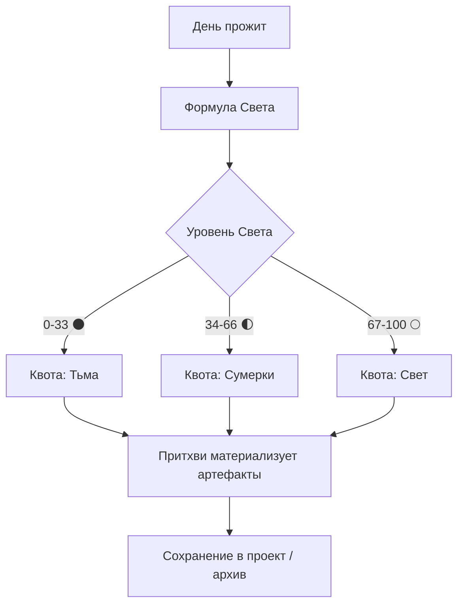

# Авто-конвейер Притхви

Создано: 2026-06-09

Автоматический конвейер материализации: переводит уровень Света прожитого дня в конкретный объём генераций (артефакты, мифы, треки, визуал). Назван в честь агента **Притхви** (Терракотовый Бастион, зона ЮЗ, стихия Земля) — отвечает за инфраструктуру и воплощение в материю.

## Поток



## Квоты по порогам

| Порог | Уровень | Что генерируется |
| --- | --- | --- |
| 🌑 Тьма | 0–33 | Совет дня + 1 артефакт |
| 🌓 Сумерки | 34–66 | Совет + миф + 3 арта + музыкальный трек |
| 🌕 Свет | 67–100 | 7 ступеней визуала + артефакт + миф + аюрведа + трек + видео-промт |

## Множители Света

| Множитель | Значение | Условие |
| --- | --- | --- |
| Серия | +5% | Несколько дней подряд активности |
| Даймон | +5% | Доверие Даймона ≥ «Голос» (см. [[../entities/daimon/ardven|Ардвен]]) |
| Резонанс | +3% | Совпадение дня с натальной картой ([[../entities/player-natal-profile|профиль игрока]]) |

## Псевдокод

```ts
function prithviPipeline(day: DayLog, player: PlayerState): GenerationPlan {
  const base = computeLightLevel(day) // 6 факторов формулы Света
  const mult =
    (player.streak ? 1.05 : 1) *
    (player.daimon.trust >= "voice" ? 1.05 : 1) *
    (resonatesWithNatal(day, player.natal) ? 1.03 : 1)
  const level = Math.min(100, Math.round(base * mult))

  if (level <= 33) return quota("dark", level)   // совет + 1 артефакт
  if (level <= 66) return quota("dusk", level)   // совет + миф + 3 арта + трек
  return quota("light", level)                    // полный пакет 🌕
}
```

## Маппинг генераций на агентов

| Тип результата | Агенты |
| --- | --- |
| Коды / тексты | Джняна + Свет Ра |
| Хроники / миф | Сарасвати |
| Артефакт | Брахма + Парвати |
| Аюрведа | Шанти + Дхарма |
| Музыка (Suno) | Ваю |
| Визуал | Теджас + Агни |
| Видео | Ананда + Теджас |
| Обложка | Теджас |
| Оркестровка | Акаша + Брахма |
| Бюджет генераций | Лакшми |
| Инфраструктура | Притхви |
| Тайминг | Искра |
| Архив | Варуна |
| Проверка | Вишну + Дхарма + Шива |

## Примечание

Генерация видео пока недоступна инструментарию — на пороге 🌕 вместо готового видео выдаётся видео-промт для ручной/внешней генерации.

## Связи

- Персональный Даймон: [[../entities/daimon/ardven|Ардвен]]
- Натальная основа резонанса: [[../entities/player-natal-profile|Профиль игрока]]
